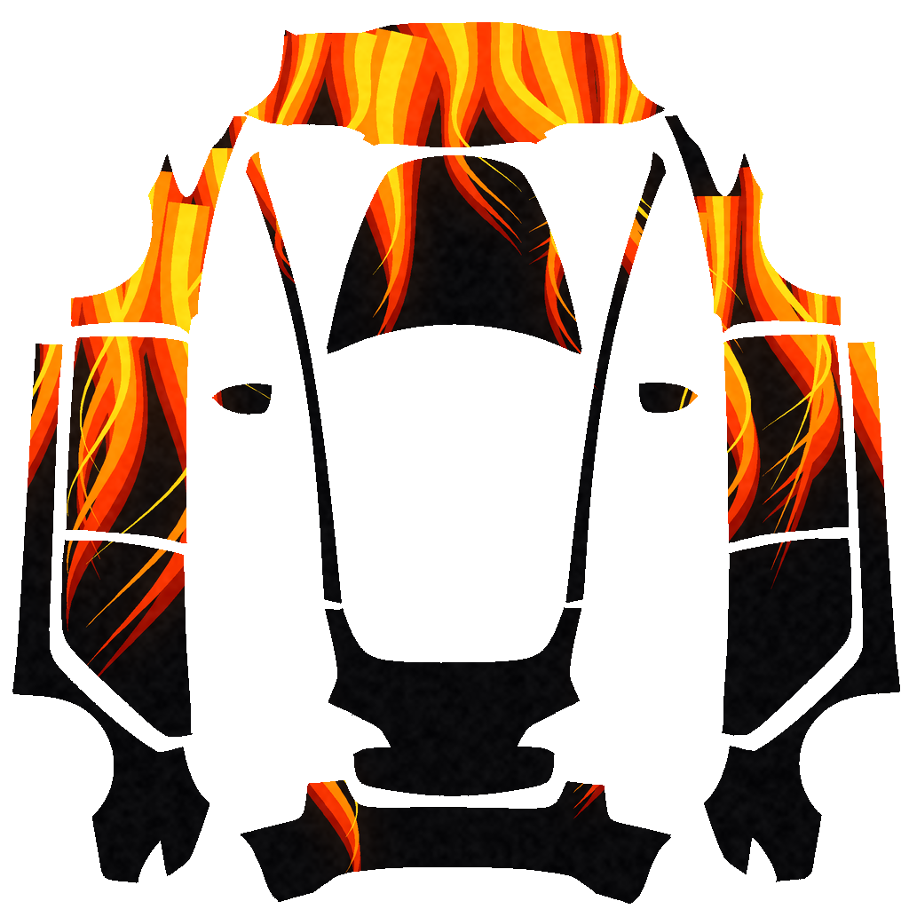
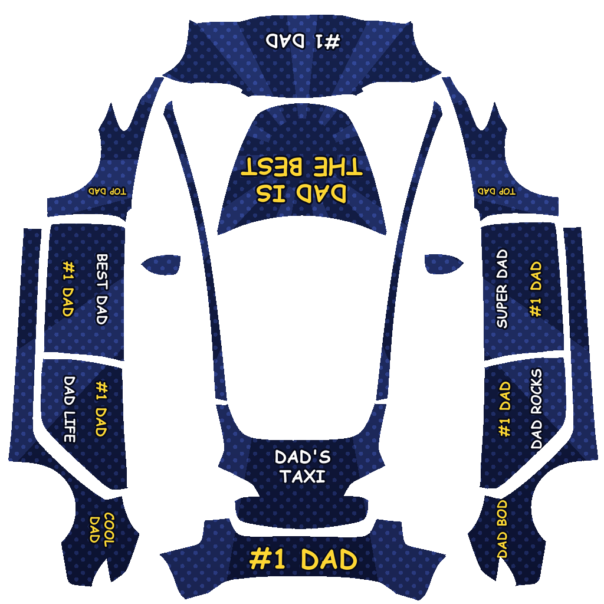
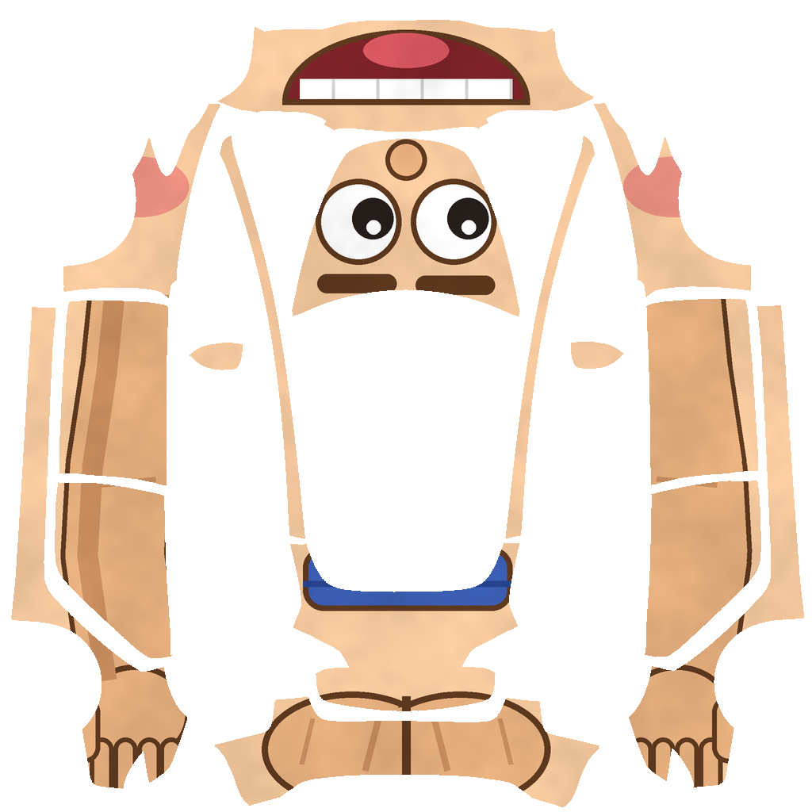
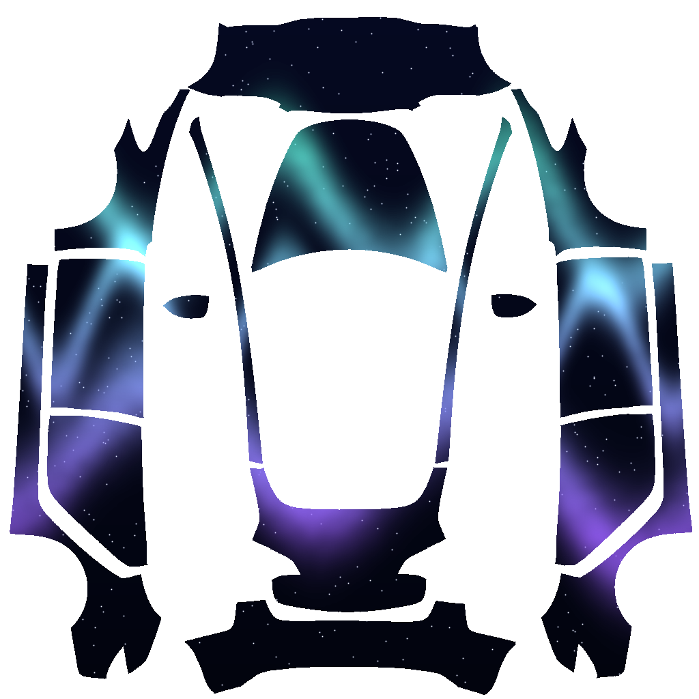
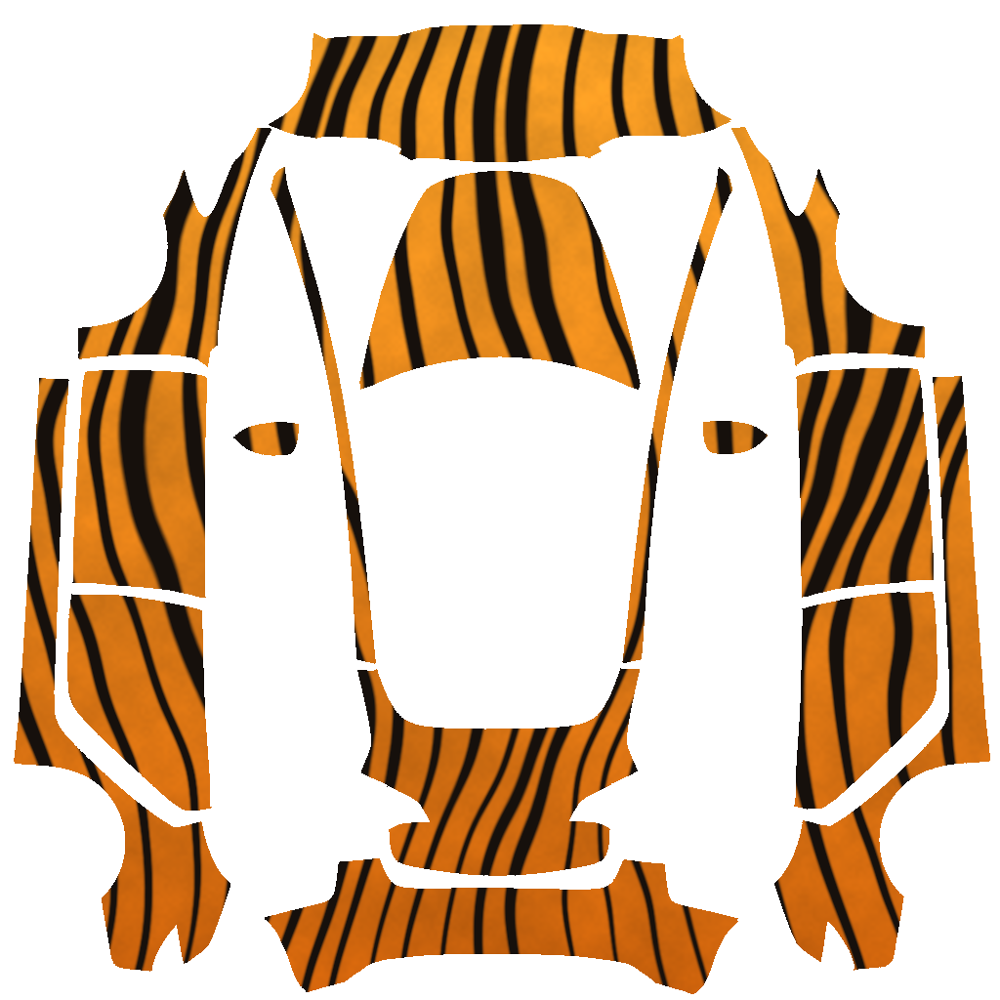
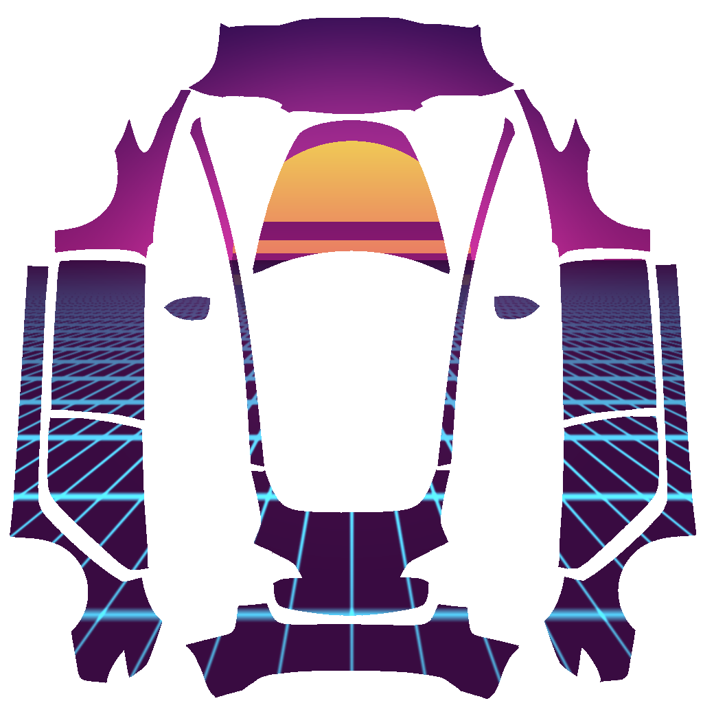
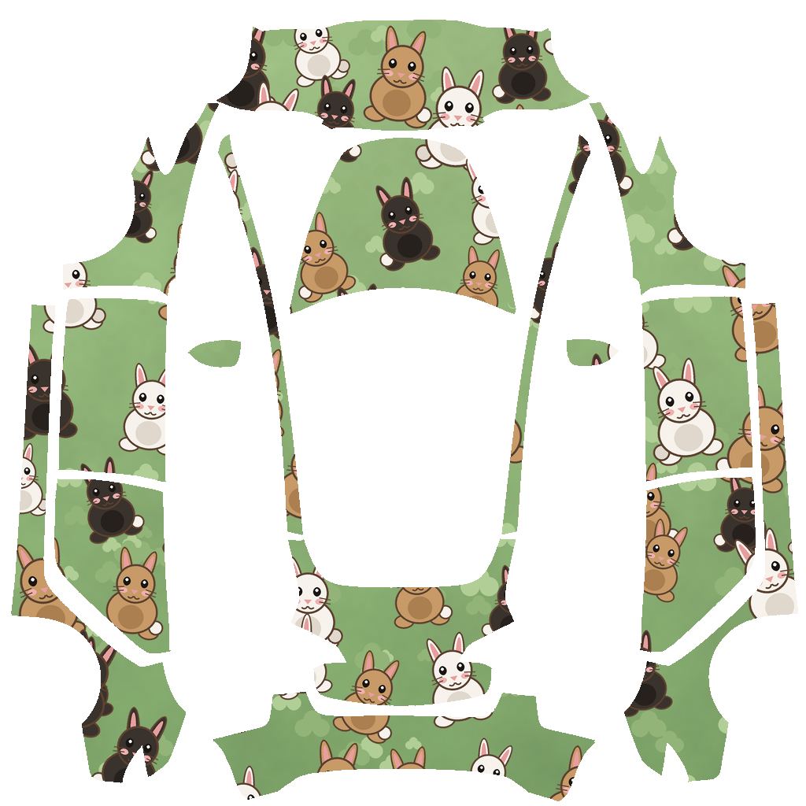

# Model 3 Custom Wraps

Custom designs built on the [Model 3 template](../template.png). Drop any of these
PNGs into the `Wraps` folder on a USB drive, or upload them from the mobile app
(Creations → Wrap → Upload), then apply them in Toybox → Paint Shop → Wraps.

## Designs

| Wrap | What it does on the car |
| --- | --- |
| **Black_Flames** | Gloss black with hot-rod flames licking back from the nose and down both flanks. |
| **Dad_Jokes** | Comic-book navy with "DAD IS THE BEST" on the hood and a joke on every panel. |
| **Cartoon_Person** | Skin tone all over: eyes on the hood, a grin across the front bumper, arms down the sides, a butt on the rear. |
| **Aurora** | Northern lights over a deep night sky, with stars scattered across the panels. |
| **Tiger_Stripes** | Amber fur with brushed black stripes wrapping around the body. |
| **Synthwave_Sunset** | Banded retro sun on the hood, neon perspective grid running back over the doors and rear. |
| **Cartoon_Rabbits** | White, light brown and black cartoon rabbits scattered over a soft green meadow, covering every panel. |

## How the template maps to the car

Useful if you want to edit these or place your own artwork:

* **Top of the image is the front of the car**, bottom is the rear.
* Center column, top to bottom: front bumper → hood → (glass roof, not wrapped) → trunk lid → rear bumper.
* Left and right columns are the flanks: front fender → front door → rear door → rear quarter, with the outer edge being the rocker.
* Front panels are unwrapped folded forward, so **artwork meant to be read from the front must be rotated 180°** — that's why the mouth on `Cartoon_Person` and the hood text on `Dad_Jokes` look upside down in the flat file.
* Rear panels keep normal orientation, and side artwork is rotated 90° (clockwise on the left, counter-clockwise on the right).

---

[← Model 3 templates and examples](../) · [Back to main page](https://github.com/teslamotors/custom-wraps)
