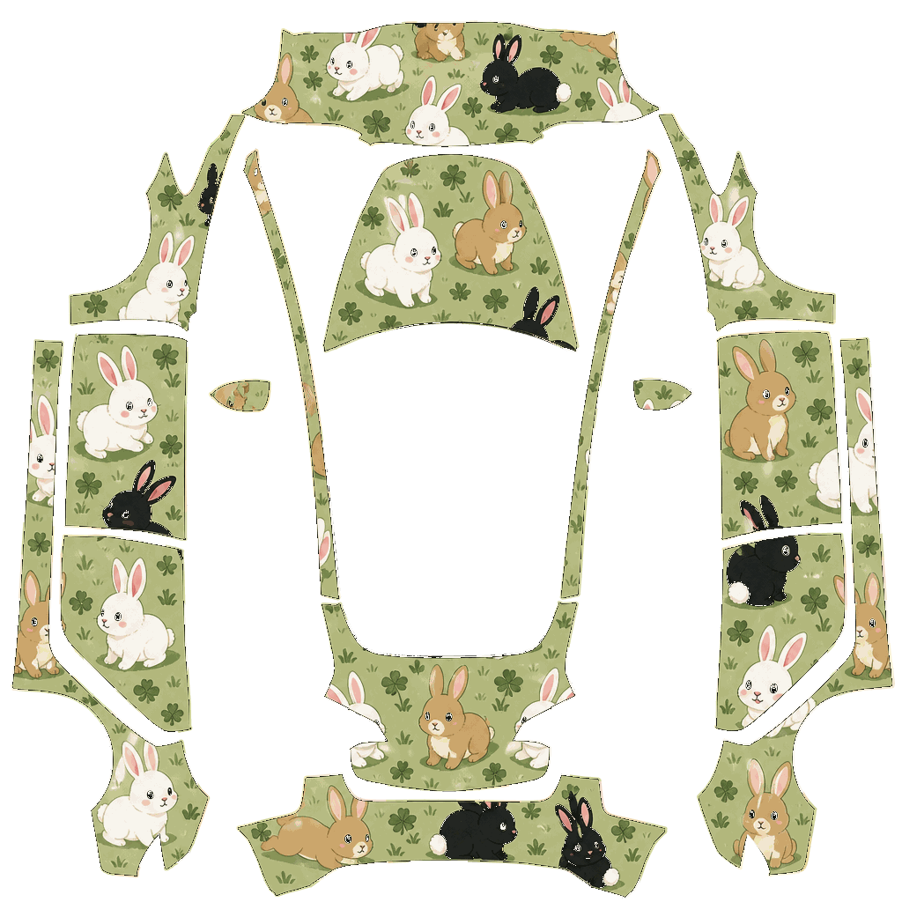
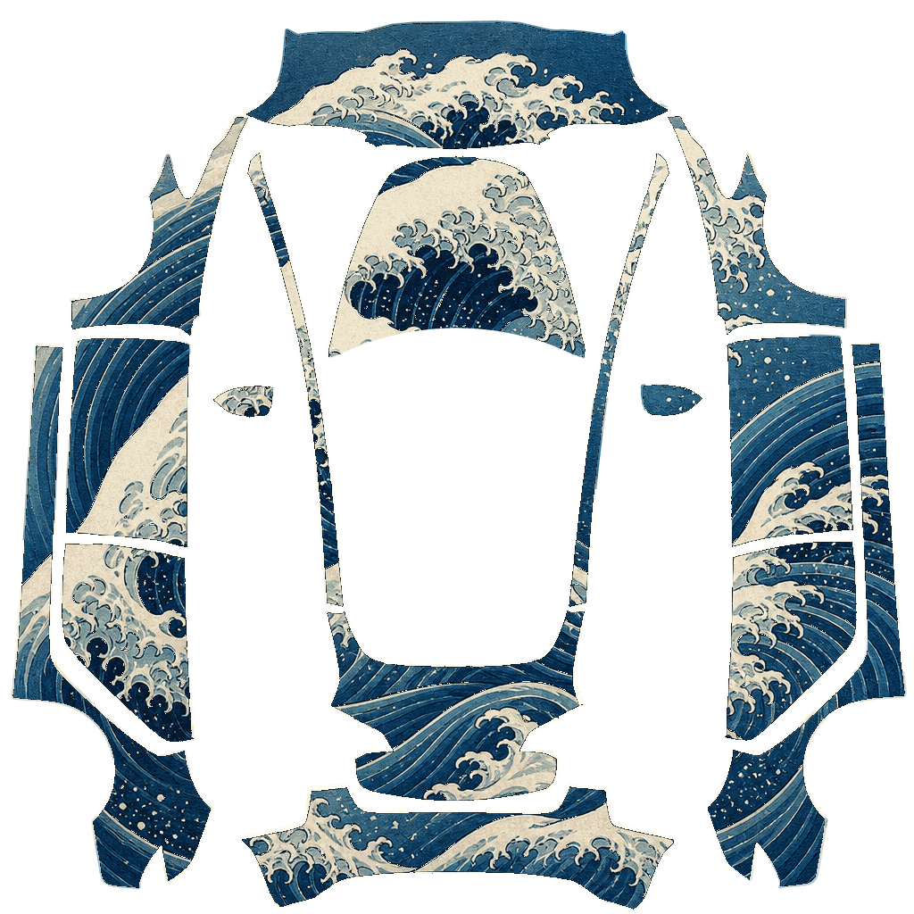
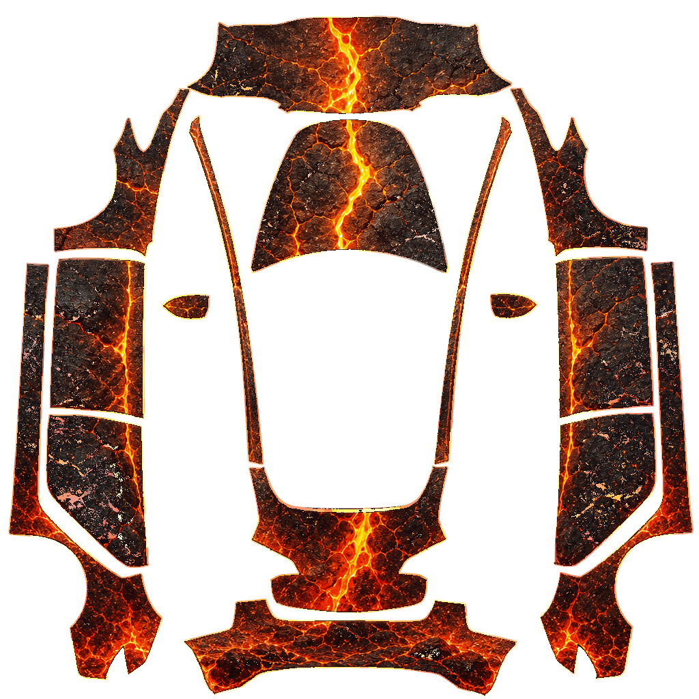
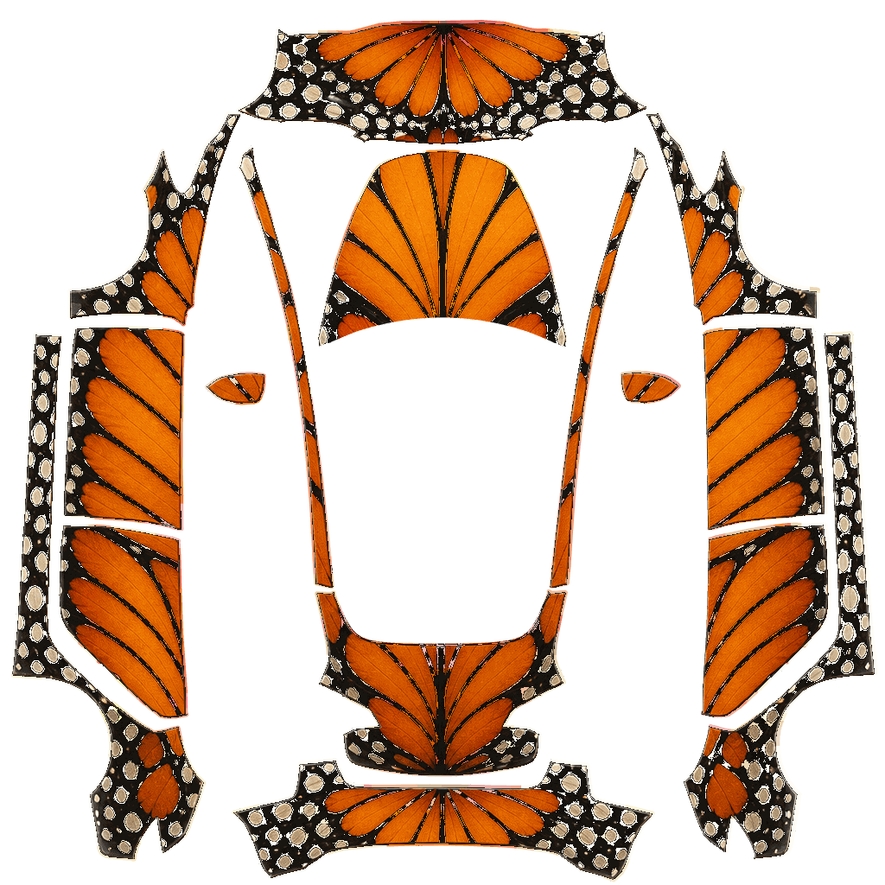
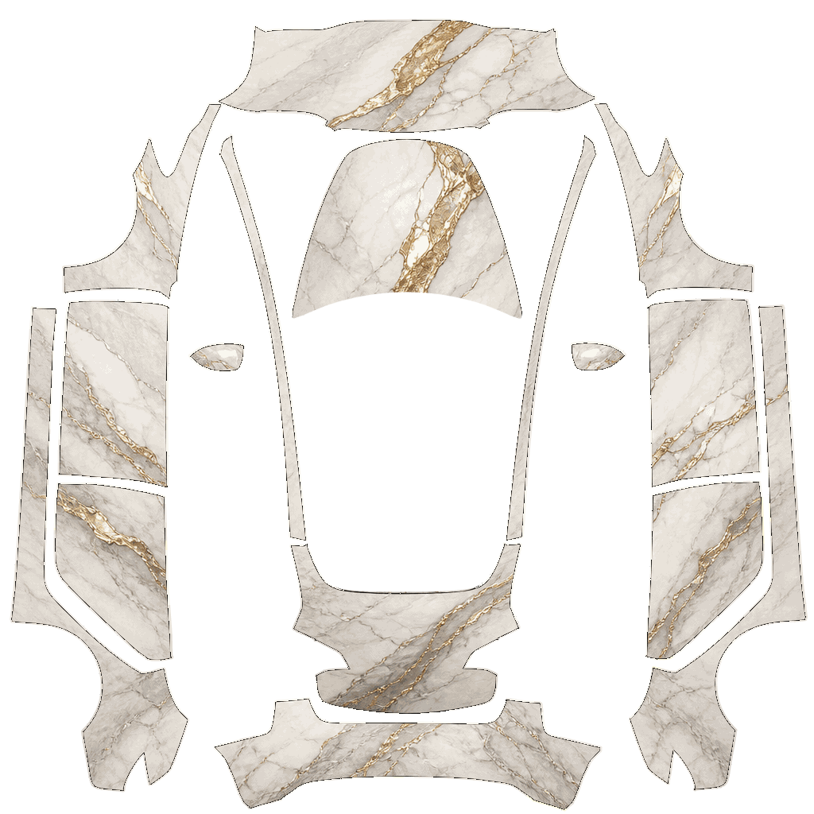
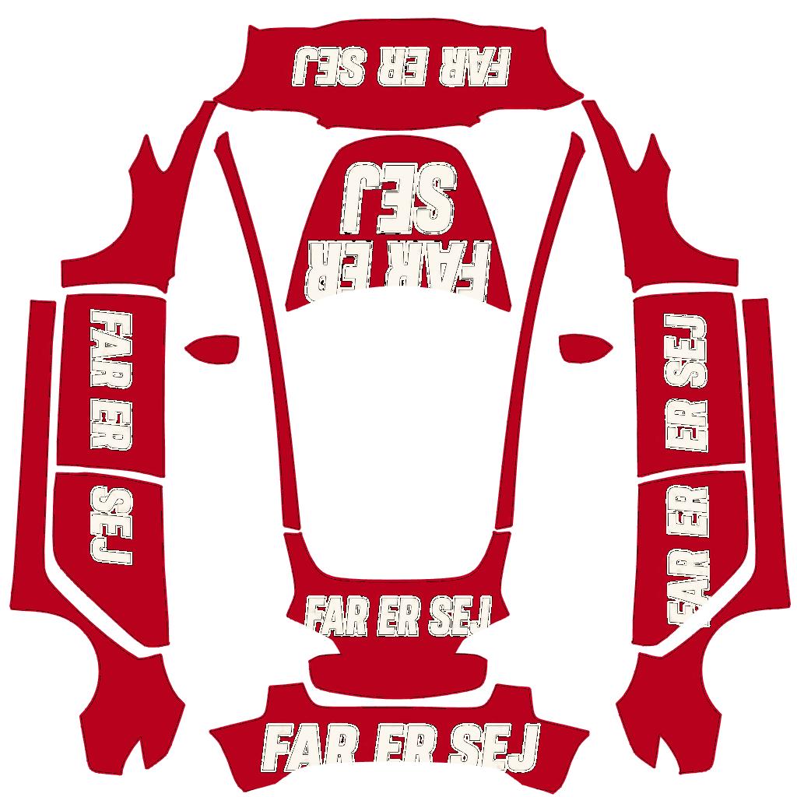
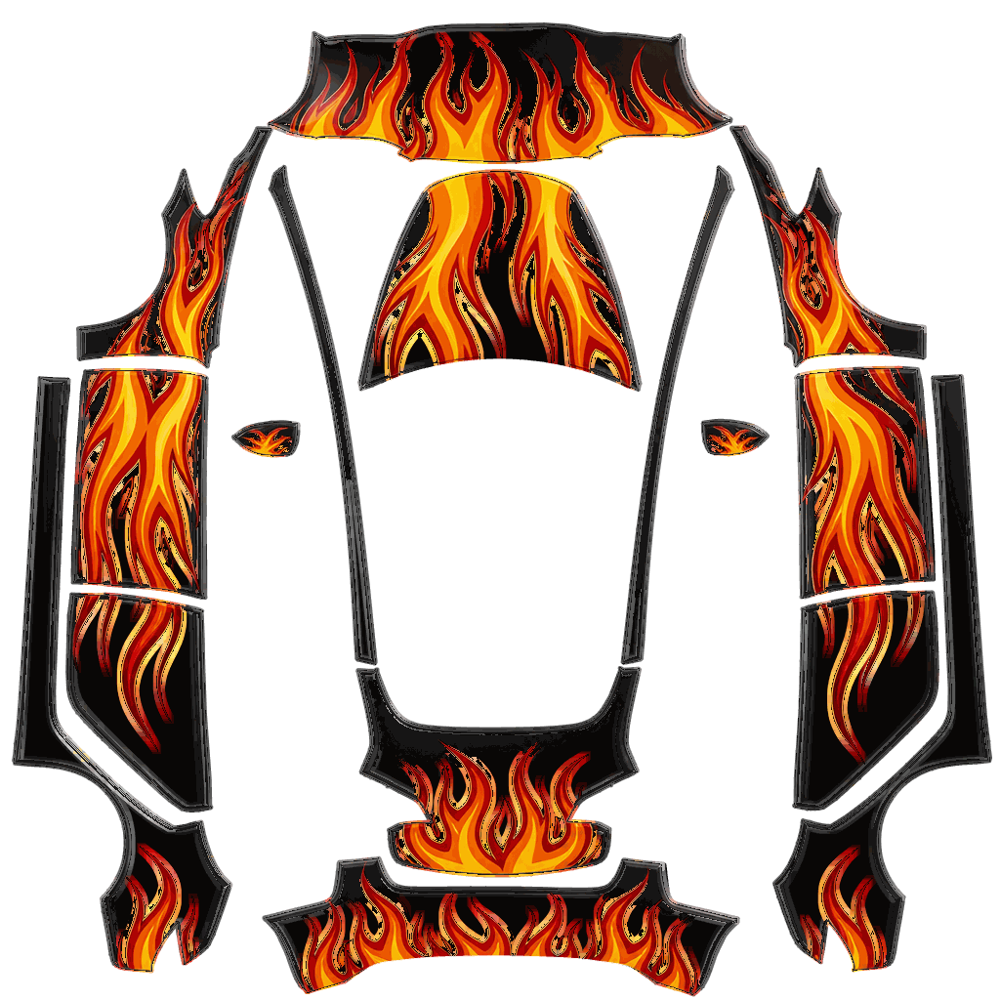
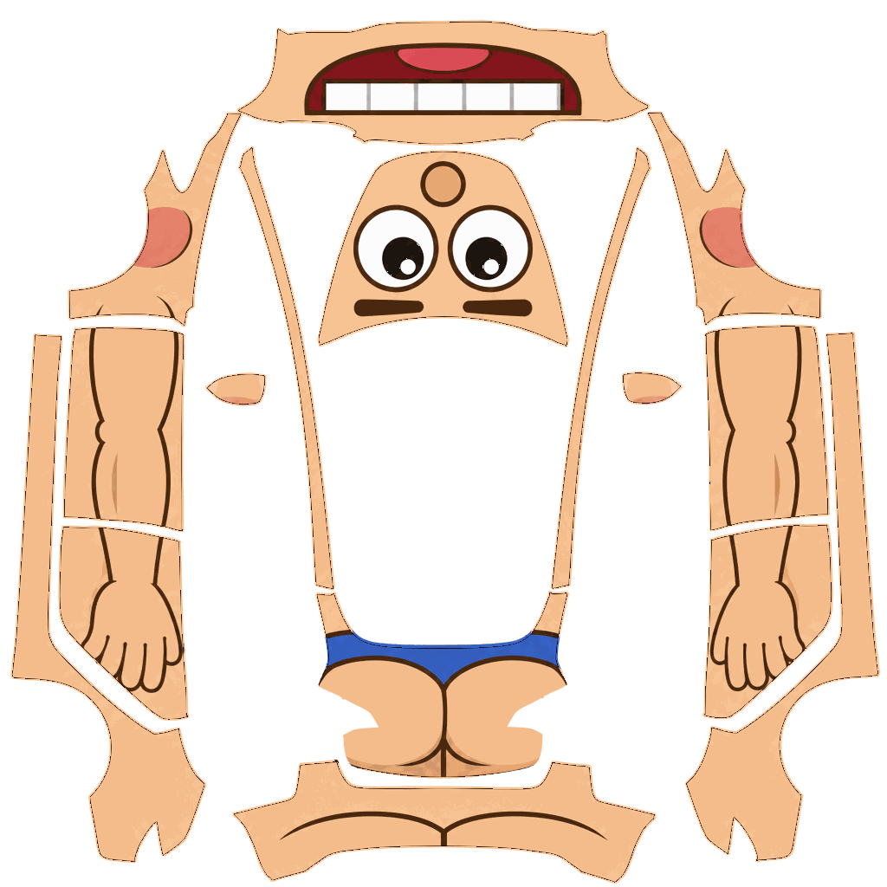

# Model 3 Wraps

Custom designs built on the [Model 3 template](../template.png). Drop any of these
PNGs into the `Wraps` folder on a USB drive, or upload them from the mobile app
(Creations → Wrap → Upload), then apply them in Toybox → Paint Shop → Wraps.

## Designs

| Wrap | What it does on the car |
| --- | --- |
| **Cartoon_Rabbits** | Sage-green meadow with white, tan, and black kawaii rabbits and clovers on every panel. |
| **Great_Wave** | Hokusai-style indigo waves and white foam crashing across the hood, doors, and bumpers. |
| **Lava_Cracks** | Cooling volcanic rock with molten orange lava rivers running down the centerline and flanks. |
| **Monarch_Wings** | Tangerine butterfly-wing scales, black veins, and white edge spots wrapping the body. |
| **Marble_Gold** | Cream Calacatta marble with sweeping metallic gold veins from nose to tail. |
| **Far_Er_Sej** | Danish-flag red with "FAR ER SEJ" on the hood, front bumper, trunk, rear bumper, and doors. |
| **Black_Flames** | Gloss black with hot-rod flames licking back from the nose and down both flanks. |
| **Cartoon_Person** | Peach skin all over: eyes on the hood, a grin across the front bumper, arms down the sides, a butt on the rear. |

---

[← Model 3 templates and examples](../) · [Back to main page](https://github.com/teslamotors/custom-wraps)
